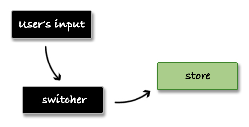
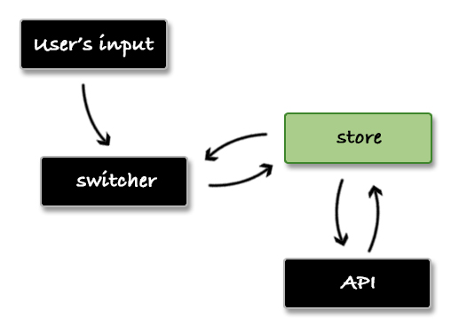

# One-way direction data flow

One-way direction data flow is a pattern that works nicely with React. It is around the idea that the components do not modify the data that they receive. They only listen for changes of this data and maybe provide the new value but they do not update the actual data. This update happens following another mechanism in another place and the component just gets re-rendered with the new value.

Let's for example get a simple `Switcher` component that contains a button. If we click it we have to enable a flag in the system.

```js
class Switcher extends React.Component {
  constructor(props) {
    super(props);
    this.state = { flag: false };
    this._onButtonClick = e => this.setState({
      flag: !this.state.flag
    });
  }
  render() {
    return (
      <button onClick={ this._onButtonClick }>
        { this.state.flag ? 'lights on' : 'lights off' }
      </button>
    );
  }
};

// ... and we render it
function App() {
  return <Switcher />;
};
```

At this moment we have the data inside our component. Or in other words, `Switcher` is the only one place that knows about our `flag`. Let's send it out to some kind of a store:

```js
var Store = {
  _flag: false,
  set: function(value) {
    this._flag = value;
  },
  get: function() {
    return this._flag;
  }
};

class Switcher extends React.Component {
  constructor(props) {
    super(props);
    this.state = { flag: false };
    this._onButtonClick = e => {
      this.setState({ flag: !this.state.flag }, () => {
        this.props.onChange(this.state.flag);
      });
    }
  }
  render() {
    return (
      <button onClick={ this._onButtonClick }>
        { this.state.flag ? 'lights on' : 'lights off' }
      </button>
    );
  }
};

function App() {
  return <Switcher onChange={ Store.set.bind(Store) } />;
};
```

Our `Store` object is a [singleton](https://addyosmani.com/resources/essentialjsdesignpatterns/book/#singletonpatternjavascript) where we have helpers for setting and getting the value of the `_flag` property. By passing the setter to the `Switcher` we are able to update the data externally. More or less our application workflow looks like that:



Let's assume that we are saving the flag value to a back-end service via the `Store`. When the user comes back we have to set a proper initial state. If the user left the flag as `true` we have to show *"lights on"* and not the default *"lights off"*. Now it gets tricky because we have the data in two places. The UI and the `Store` have their own states. We have to communicate in both directions from the store to the switcher and from the switcher to the store.

```js
// ... in App component
<Switcher
  value={ Store.get() }
  onChange={ Store.set.bind(Store) } />

// ... in Switcher component
constructor(props) {
  super(props);
  this.state = { flag: this.props.value };
  ...
```

Our workflow changes to the following:



All this leads to managing two states instead of one. What if the `Store` changes its value based on other actions in the system. We have to propagate that change to the `Switcher` and we increase the complexity of our app.

One-way direction data flow solves this problem. It eliminates the multiple places where we manage states and deals with only one which is usually the store. To achieve that we have to tweak our `Store` object a little bit. We need logic that allows us to subscribe for changes:

<span class="new-page"></span>

```js
var Store = {
  _handlers: [],
  _flag: '',
  subscribe: function(handler) {
    this._handlers.push(handler);
  },
  set: function(value) {
    this._flag = value;
    this._handlers.forEach(handler => handler(value))
  },
  get: function() {
    return this._flag;
  }
};
```

Then we will hook our main `App` component and we'll re-render it every time when the `Store` changes its value:

```js
class App extends React.Component {
  constructor(props) {
    super(props);

    this.state = { value: Store.get() };
    Store.subscribe(value => this.setState({ value }));
  }
  render() {
    return (
      <div>
        <Switcher
          value={ this.state.value }
          onChange={ Store.set.bind(Store) } />
      </div>
    );
  }
};
```

Because of this change the `Switcher` becomes really simple. We don't need the internal state and the component may be written as a stateless function.

```js
function Switcher({ value, onChange }) {
  return (
    <button onClick={ e => onChange(!value) }>
      { value ? 'lights on' : 'lights off' }
    </button>
  );
};

<Switcher
  value={ Store.get() }
  onChange={ Store.set.bind(Store) } />
```

## Final thoughts

The benefit that comes with this pattern is that our components become dummy representation of the store's data. There is only one source of truth and this makes the development easier. If you are going to take one thing from this book I would prefer to be this chapter. The one-direction data flow drastically changed the way of how I think when designing a feature so I believe it will have the same effect on you.
